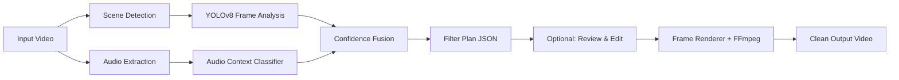

<div align="center">
  
  <h1>PureFrame</h1>
  <p><strong>Watch any movie with your family. Without cutting a single second.</strong></p>
  <p>PureFrame applies smart, localized blurs over explicit visuals - no cuts, no audio edits, no streaming, no subscription.</p>

  <a href="#install"></a>
  <a href="LICENSE"></a>
  <a href="https://github.com/xenoaitham/PureFrame/actions"></a>
  


  <br /><br />
  
</div>

---

PureFrame is a local AI tool that finds explicit visuals in common local video files - nudity, sexual activity, intense kissing - and applies a localized, smoothly-tracked blur over the flagged regions. No scene skipping. No audio cuts. No streaming, no cloud, no subscription. The full movie plays normally; you just don't see the parts you'd rather not.

## Install

```bash
pip install pureframe
```

> **Requirements:** Python 3.11+, FFmpeg installed and on PATH. GPU recommended but not required.

## Quick Start

```bash
# One-shot: detect and blur in a single pass
pureframe process movie.mp4 --output movie_clean.mp4

# Or split it: generate a plan, review it, then apply
pureframe plan movie.mp4                                           # → movie.censorplan.json
pureframe apply movie.mp4 movie.censorplan.json --output movie_clean.mp4

# Whitelist a false positive by shot index before applying
pureframe plan-whitelist movie.censorplan.json 3 7
```

The plan file is plain JSON - open it, review every flagged shot, whitelist anything you disagree with, then apply. Nothing renders until you say so.

## Why PureFrame?

**No scene skipping.** Most "family-friendly" tools just fast-forward through flagged scenes. You lose dialog, plot, pacing. PureFrame applies a localized Gaussian blur tracked to bounding boxes - the scene plays normally, you just can't see what's behind the blur.

**No cloud, no subscription.** Everything runs on your machine. Your videos never leave your disk. Once the AI models download on first run (~400MB), PureFrame works fully offline.

**Works on common local video files.** VidAngel and ClearPlay only support a curated list of popular titles. PureFrame uses computer vision - it works on any MP4, MKV, AVI, or WebM you throw at it. Foreign films, indie movies, decades-old DVDs, whatever.

**Audio-aware detection.** An audio classifier runs alongside the visual pipeline to disambiguate scenes that look ambiguous on camera but are clear from context - keeping false positives low without sacrificing coverage.

**Review before rendering.** The `plan` command generates a JSON file with every detection, bounding box, confidence score, and reasoning. You can inspect it, whitelist false positives, or adjust thresholds before committing to the render.

## How It Works



1. **Scene detection** splits the video into shots using adaptive threshold detection.
2. **YOLOv8** analyzes sampled frames for nudity, sexual content, and face proximity (kissing detection).
3. **Audio classification** provides ambient context to reduce false positives.
4. A **confidence fusion engine** combines visual + audio signals with configurable thresholds.
5. Results are written to a **filter plan** (`.censorplan.json`) - fully editable before rendering.
6. The **renderer** reads the plan, applies tracked bounding-box blurs frame-by-frame, and re-encodes with FFmpeg.

## Comparison

| | PureFrame | VidAngel / ClearPlay | Manual Editing |
|---|---|---|---|
| Cuts video length? | **No** - localized blur | Yes - skips scenes | Optional |
| Cost | **Free & open source** | $9.99/mo subscription | Expensive software |
| Requires internet? | **No** | Yes | No |
| Works on local files? | **Yes** | No - curated list only | Yes |
| Reviewable before apply? | **Yes** - JSON plan | No | N/A |

## Performance

Measured on author's machine: RTX 3060 12GB, i5-10400F, Pop!_OS.

| Profile | 30s synthetic 1080p clip | Extrapolated 90-min movie |
|---|---:|---:|
| HIGH | 25.96s | ~78 min |
| MEDIUM | 41.23s | ~124 min |
| LOW | 27.83s | ~83 min |
| CPU | 21.37s* | ~64 min* |

These are synthetic zero-detection numbers. Real movies with detections can be slower.

Set your profile with `--profile`:
```bash
pureframe process movie.mp4 --output out.mp4 --profile MEDIUM
```

See [BENCHMARKS.md](BENCHMARKS.md) for full metrics and how to run benchmarks.

## Desktop App

PureFrame includes a Tauri desktop GUI with drag-and-drop video import, flagged-shot review, and one-click whitelisting.


```bash
cd gui && npm install && npm run tauri dev
```

## Known Limitations

PureFrame is open-source AI software in early stages. Real-world performance depends on the content:

- **First run downloads ~500MB of AI model weights.** Subsequent runs are fully offline.
- **False positives are real.** Especially on swimwear, intimate-but-non-sexual content, and stylized animation. Always run `pureframe plan` first and review the JSON before committing to a render. Use `pureframe plan-whitelist` to remove false positives.
- **Animation needs different thresholds** than live action. A `--content-type` flag is planned for v0.2.
- **Detection is not perfect.** Some explicit content will slip through. PureFrame is a tool to make most content family-safe - it is not a replacement for parental judgment.
- **Hardware encoding** (NVENC, QSV, VideoToolbox) is planned but not yet active. All rendering goes through software FFmpeg encoding.
- **DRM-protected and streaming content is not supported** and will not be supported. PureFrame only operates on files you legally own and can read.

## FAQ

<details>
<summary><strong>Is this legal?</strong></summary>
<br />
PureFrame is intended for private, local use on media files you legally possess. It does not bypass DRM, download media, upload media, or distribute altered copies. Laws vary by jurisdiction, and because PureFrame can create an output file, the legal status may depend on your use case. This is not legal advice.
</details>

<details>
<summary><strong>Does it work offline?</strong></summary>
<br />
Yes. After the first run downloads the AI models (~500MB), PureFrame never makes a network request.
</details>

<details>
<summary><strong>Will it ruin the movie?</strong></summary>
<br />
No. PureFrame never cuts audio, skips frames, or alters the timeline. It applies a localized blur that tracks the content smoothly across frames using temporal interpolation. The pacing and narrative remain exactly as intended.
</details>

<details>
<summary><strong>Can I review what gets filtered before applying?</strong></summary>
<br />
Yes. Run <code>pureframe plan</code> to generate a <code>.censorplan.json</code> file. Open it in the desktop GUI or any text editor. Every flagged shot includes the category, confidence, reasoning, and frame-level bounding boxes. Whitelist anything you disagree with, then run <code>pureframe apply</code>.
</details>

<details>
<summary><strong>Does it handle DRM or streaming?</strong></summary>
<br />
No. PureFrame only processes local, unencrypted video files. It will not attempt to bypass DRM or intercept streaming content.
</details>


## Acknowledgments

PureFrame builds on excellent open-source work: [NudeNet](https://github.com/notAI-tech/NudeNet) for nudity detection, [PySceneDetect](https://github.com/Breakthrough/PySceneDetect) for shot boundary detection, [CLIP](https://github.com/openai/CLIP) for scene understanding, [PANNs](https://github.com/qiuqiangkong/audioset_tagging_cnn) for audio classification, [FFmpeg](https://ffmpeg.org/) for video I/O, and [Tauri](https://tauri.app/) for the desktop application. Thank you to those projects' maintainers.

## Contributing

See [CONTRIBUTING.md](docs/CONTRIBUTING.md). PRs welcome.

## License

[MIT](LICENSE)
