<div align="center">
  
  <h1>PureFrame</h1>
  <p><strong>Watch any movie with your family. Without cutting a single second.</strong></p>
  <p>PureFrame applies smart, localized blurs over explicit visuals - no cuts, no audio edits, no streaming, no subscription.</p>

  <a href="#install"></a>
  <a href="LICENSE"></a>
  <a href="https://github.com/xenoaitham/PureFrame/actions"></a>
  <a href="https://codecov.io/gh/xenoaitham/PureFrame"></a>
  
  
  
  
  

  <br /><br />
  
</div>

---

PureFrame is a local AI tool that finds explicit visuals in common video files - nudity, sexual activity, intense kissing - and applies a localized, smoothly-tracked blur over the flagged regions. No scene skipping. No audio cuts. No streaming, no cloud, no subscription. The full movie plays normally; you just don't see the parts you'd rather not.

## Downloads

Pre-built binaries. Grab the latest release.

### Desktop GUI (Tauri)

Native installer with the graphical UI:

- **Windows** - [PureFrame_x64-setup.exe](https://github.com/xenoaitham/PureFrame/releases/latest) or `.msi`
- **macOS (Apple Silicon)** - `PureFrame_aarch64.dmg`
- **macOS (Intel)** - `PureFrame_x64.dmg`
- **Linux** - `.AppImage`, `.deb`, or `.rpm`

### CLI / standalone (PyInstaller)

No Python needed:

- **Windows** - [pureframe-windows-x86_64.zip](https://github.com/xenoaitham/PureFrame/releases/latest/download/pureframe-windows-x86_64.zip)
- **macOS (Apple Silicon)** - [pureframe-macos-arm64.tar.gz](https://github.com/xenoaitham/PureFrame/releases/latest/download/pureframe-macos-arm64.tar.gz)
- **Linux (x86_64)** - [pureframe-linux-x86_64.tar.gz](https://github.com/xenoaitham/PureFrame/releases/latest/download/pureframe-linux-x86_64.tar.gz)

> **Intel mac users:** no standalone PyInstaller build (GitHub-hosted `macos-13` runners are EOL'd and perpetually backlogged). Use `pip install pureframe` or the Tauri `PureFrame_0.1.4_x64.dmg` installer.

Extract anywhere, then run `pureframe --help` (Windows: `pureframe.exe --help`).

- **Windows zip is fully self-contained** - bundled `ffmpeg.exe` + `ffprobe.exe`, no install required.
- macOS / Linux tarballs require ffmpeg on PATH (`brew install ffmpeg` / `apt install ffmpeg`).

### Code signing

Binaries are **not code-signed** (no paid Apple/Microsoft certs yet).

- **Windows:** SmartScreen warns "Windows protected your PC" → click *More info* → *Run anyway*.
- **macOS:** Gatekeeper blocks "from an unidentified developer" → right-click the `.app` / binary → *Open* → confirm. Or run `xattr -dr com.apple.quarantine /path/to/PureFrame.app`.
- **Linux:** no signing required.

Verify downloads against the SHA-256 sums attached to each release.

## Install

```bash
# From PyPI
pip install pureframe

# From source (development)
git clone https://github.com/xenoaitham/PureFrame.git
cd PureFrame
pip install -e ".[dev]"
```

> **Requirements:** Python 3.11+, FFmpeg installed and on PATH. GPU recommended but not required.
> See [Installation Guide](docs/installation.md) for platform-specific instructions, GPU setup, and troubleshooting.

## Quick Start

```bash
# One-shot: detect and blur in a single pass
pureframe process movie.mp4 --output movie_clean.mp4

# Or split it: generate a plan, review it, then apply
pureframe plan movie.mp4                              # → movie.censorplan.json
pureframe plan-edit movie.censorplan.json              # Review in your editor
pureframe plan-whitelist movie.censorplan.json 3       # Whitelist false positive
pureframe apply movie.mp4 movie.censorplan.json        # Render final output

# Preview flagged shots without watching the whole video
pureframe preview movie.censorplan.json                # → HTML contact sheet
```

The plan file is plain JSON - open it, review every flagged shot, whitelist anything you disagree with, then apply. Nothing renders until you say so.

## Content-Type Profiles

Different content needs different detection settings:

```bash
# Live-action movies and TV (default)
pureframe process movie.mp4 --content-type live-action

# Animated content (higher thresholds to reduce false positives)
pureframe process cartoon.mp4 --content-type animation

# Anime (tuned for anime art styles)
pureframe process anime.mkv --content-type anime

# Dark/low-light scenes (increased sensitivity)
pureframe process horror.mp4 --content-type low-light
```

## Strictness Levels

Control how aggressively PureFrame flags content:

```bash
pureframe process movie.mp4 --strictness low     # Minimal censoring
pureframe process movie.mp4 --strictness medium   # Balanced (default)
pureframe process movie.mp4 --strictness high     # Aggressive
pureframe process movie.mp4 --threshold 0.35      # Custom threshold
```

See [Evaluation Report](docs/evaluation.md) for threshold calibration guide.

## Why PureFrame?

**No scene skipping.** Most "family-friendly" tools just fast-forward through flagged scenes. You lose dialog, plot, pacing. PureFrame applies a localized Gaussian blur tracked to bounding boxes - the scene plays normally, you just can't see what's behind the blur.

**No cloud, no subscription.** Everything runs on your machine. Your videos never leave your disk. Once the AI models download on first run (~400-500MB), PureFrame works fully offline. Zero telemetry.

**Works on any local video file.** VidAngel and ClearPlay only support a curated list of popular titles. PureFrame uses computer vision - it works on any MP4, MKV, AVI, or WebM you throw at it. Foreign films, indie movies, decades-old DVDs.

**Audio-aware detection.** An audio classifier runs alongside the visual pipeline to disambiguate ambiguous scenes - reducing false positives without sacrificing coverage.

**Review before rendering.** The `plan` command generates a JSON file with every detection, bounding box, confidence score, and reasoning. Inspect it, whitelist false positives, or adjust thresholds before committing to the render.

## How It Works

```mermaid
flowchart TD
    A[Input Video] --> B[Scene Detection]
    A --> C[Audio Extraction]
    B --> D[NudeNet Frame Analysis]
    B --> D2[CLIP Scene Classification]
    C --> E[PANNs Audio Classifier]
    D --> F[Confidence Fusion]
    D2 --> F
    E --> F
    F --> G[Censor Plan JSON]
    G --> H[Review & Edit]
    H --> I[FFmpeg Renderer]
    I --> J[Clean Output Video]
```



1. **Scene detection** splits the video into shots using adaptive threshold detection (PySceneDetect).
2. **NudeNet** analyzes sampled frames for nudity with localized bounding boxes.
3. **CLIP** provides scene-level semantic classification for sexual activity detection.
4. **PANNs** classifies audio events (moaning detection) for context disambiguation.
5. A **confidence fusion engine** combines all signals with configurable per-category thresholds.
6. Results are written to a **censor plan** (`.censorplan.json`) - fully editable before rendering.
7. The **renderer** applies tracked bounding-box blurs frame-by-frame and re-encodes with FFmpeg.

## Comparison

| Feature | PureFrame | VidAngel / ClearPlay | Manual Editing |
|---|---|---|---|
| Cuts video length? | No - localized blur | Yes - skips scenes | Optional |
| Cost | Free & open source | $9.99/mo subscription | Expensive software |
| Requires internet? | No | Yes | No |
| Works on local files? | Yes | No - curated list only | Yes |
| Reviewable before apply? | Yes - JSON plan | No | N/A |
| Content-type profiles? | Yes | Limited | No |
| Audio-aware detection? | Yes | Varies | No |
| 100% offline? | Yes (after model download) | No | Yes |

## Performance

Measured on author's machine: RTX 3060 12GB, i5-10400F, Pop!_OS.

| Profile | 30s synthetic 1080p clip | Extrapolated 90-min movie |
|---|---:|---:|
| HIGH | 25.96s | ~78 min |
| MEDIUM | 41.23s | ~124 min |
| LOW | 27.83s | ~83 min |
| CPU | 21.37s* | ~64 min* |

*Synthetic zero-detection numbers. Real movies with detections will be slower.*

```bash
pureframe process movie.mp4 --profile MEDIUM
```

See [BENCHMARKS.md](BENCHMARKS.md) for full metrics and how to run benchmarks.

## Desktop App (Experimental)

PureFrame includes an experimental [Tauri](https://tauri.app/) desktop GUI with:

- ✅ File drag-and-drop queue
- ✅ Plan editor with color-coded timeline
- ✅ Shot-level thumbnail preview
- ✅ One-click whitelist/blacklist
- ✅ Hardware profile settings
- ✅ Detection sensitivity slider
- 🔜 Timeline scrubbing
- 🔜 Before/after preview

```bash
cd gui && npm install && npm run tauri dev
```

## Known Limitations

PureFrame is honest about what it can and can't do. See [KNOWN_LIMITATIONS.md](docs/KNOWN_LIMITATIONS.md) for a full breakdown of false positive/negative categories, audio detection gaps, and rendering limitations.

Briefly:
- **False positives** happen on swimwear, skin-tone backgrounds, and stylized animation.
- **Dark scenes** reduce detection confidence. Use `--content-type low-light`.
- **Not perfect.** Some explicit content may slip through. PureFrame is a tool - not a replacement for parental judgment.

## FAQ

<details>
<summary><strong>Is this legal?</strong></summary>

PureFrame is intended for private, local use on media files you legally possess. It does not bypass DRM, download media, upload media, or distribute altered copies. Laws vary by jurisdiction. This is not legal advice. See [Legal](docs/legal.md).
</details>

<details>
<summary><strong>Does it work offline?</strong></summary>

Yes. After the first run downloads AI models (~400-500MB), PureFrame never makes a network request. Zero telemetry. See [Privacy Policy](docs/privacy.md).
</details>

<details>
<summary><strong>Will it ruin the movie?</strong></summary>

No. PureFrame never cuts audio, skips frames, or alters the timeline. It applies a localized blur tracked smoothly across frames. Pacing and narrative remain exactly as intended.
</details>

<details>
<summary><strong>Can I review what gets filtered before applying?</strong></summary>

Yes. Run `pureframe plan` to generate a `.censorplan.json` file. Every flagged shot includes category, confidence, reasoning, and bounding boxes. Whitelist anything you disagree with, then run `pureframe apply`. See [Censor Plan Schema](docs/censor-plan-schema.md).
</details>

<details>
<summary><strong>How do I choose the right threshold?</strong></summary>

Start with `--strictness medium` (default). If you see false positives on swimwear/skin, use `--strictness low`. If explicit content slips through, use `--strictness high`. See the [Confidence Calibration Guide](docs/CALIBRATION.md).
</details>

<details>
<summary><strong>Does it handle DRM or streaming?</strong></summary>

No. PureFrame only processes local, unencrypted video files. It will not attempt to bypass DRM or intercept streaming content.
</details>

<details>
<summary><strong>Where are models stored?</strong></summary>

Models are cached in your system's standard cache directory (`~/.cache/` on Linux, `~/Library/Caches/` on macOS, `%LOCALAPPDATA%\cache\` on Windows). See [Installation Guide](docs/installation.md#model-downloads) for details and deletion instructions.
</details>

## Documentation

| Document | Description |
|----------|-------------|
| [Installation Guide](docs/installation.md) | Platform-specific install, GPU setup, troubleshooting |
| [CLI Reference](docs/cli-reference.md) | All commands, options, and examples |
| [Confidence Calibration](docs/CALIBRATION.md) | Threshold presets, content types, and tuning workflow |
| [Known Limitations](docs/KNOWN_LIMITATIONS.md) | False positives/negatives, edge cases, audio gaps |
| [Evaluation Report](docs/evaluation.md) | Detection accuracy and synthetic benchmarks |
| [Censor Plan Schema](docs/censor-plan-schema.md) | JSON schema reference |
| [Architecture](docs/architecture.md) | Pipeline diagram and component details |
| [Privacy Policy](docs/privacy.md) | Data handling and telemetry statement |
| [Security Policy](SECURITY.md) | Threat model and vulnerability reporting |
| [Legal](docs/legal.md) | Legal considerations and terms |
| [Contributing](CONTRIBUTING.md) | How to contribute |
| [Changelog](CHANGELOG.md) | Release history |
| [Roadmap](ROADMAP.md) | Planned features |
| [Benchmarks](BENCHMARKS.md) | Performance metrics |
| [Examples](examples/) | Example commands and censor plans |

## Acknowledgments

PureFrame builds on excellent open-source work: [NudeNet](https://github.com/notAI-tech/NudeNet) for nudity detection, [PySceneDetect](https://github.com/Breakthrough/PySceneDetect) for shot boundary detection, [CLIP](https://github.com/openai/CLIP) for scene understanding, [PANNs](https://github.com/qiuqiangkong/audioset_tagging_cnn) for audio classification, [FFmpeg](https://ffmpeg.org/) for video I/O, and [Tauri](https://tauri.app/) for the desktop GUI.

## Contributing

Contributions welcome! See [CONTRIBUTING.md](CONTRIBUTING.md). Look for issues labeled `good first issue`.

## License

[MIT](LICENSE)
