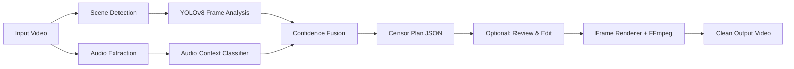

<div align="center">
  
  <h1>PureFrame</h1>
  <p><strong>Watch any movie with your family. Without cutting a single second.</strong></p>

  <a href="#install"></a>
  <a href="LICENSE"></a>
  <a href="https://github.com/xenoaitham/PureFrame/actions"></a>

  <br /><br />
  
</div>

---

PureFrame detects explicit visual content in any local video file - nudity, sexual activity, kissing - and applies real-time localized blurring directly over the flagged regions. No scene skipping. No audio cuts. No cloud. No subscription.

You keep 100% of the movie. Your family just doesn't see the parts you'd rather they didn't.

## Install

```bash
pip install pureframe
```

> **Requirements:** Python 3.11+, FFmpeg installed and on PATH. GPU recommended but not required.

## Quick Start

```bash
# One-shot: detect and censor in a single pass
pureframe run movie.mp4 -o movie_clean.mp4

# Or split it: generate a plan, review it, then apply
pureframe plan movie.mp4                    # → movie.censorplan.json
pureframe apply movie.mp4 movie.censorplan.json -o movie_clean.mp4
```

The plan file is plain JSON - open it, review every flagged shot, whitelist anything you disagree with, then apply. Nothing renders until you say so.

## Why PureFrame?

**No scene skipping.** Most "family-friendly" tools just fast-forward through flagged scenes. You lose dialog, plot, pacing. PureFrame applies a localized Gaussian blur tracked to bounding boxes - the scene plays normally, you just can't see what's behind the blur.

**No cloud, no subscription.** Everything runs on your machine. Your videos never leave your disk. Once the AI models download on first run (~400MB), PureFrame works fully offline.

**Works on any file.** VidAngel and ClearPlay only support a curated list of popular titles. PureFrame uses computer vision - it works on any MP4, MKV, AVI, or WebM you throw at it. Foreign films, indie movies, decades-old DVDs, whatever.

**Audio-aware detection.** A zero-shot audio classifier runs alongside the visual pipeline to distinguish between ambiguous scenes. It knows the difference between a gym and a bedroom.

**Review before rendering.** The `plan` command generates a JSON file with every detection, bounding box, confidence score, and reasoning. You can inspect it, whitelist false positives, or adjust thresholds before committing to the render.

## How It Works



1. **Scene detection** splits the video into shots using adaptive threshold detection.
2. **YOLOv8** analyzes sampled frames for nudity, sexual content, and face proximity (kissing detection).
3. **Audio classification** provides ambient context to reduce false positives.
4. A **confidence fusion engine** combines visual + audio signals with configurable thresholds.
5. Results are written to a **censor plan** (JSON) - fully editable.
6. The **renderer** reads the plan, applies tracked bounding-box blurs frame-by-frame, and re-encodes with FFmpeg.

## Comparison

| | PureFrame | VidAngel / ClearPlay | Manual Editing |
|---|---|---|---|
| Cuts video length? | **No** - localized blur | Yes - skips scenes | Optional |
| Cost | **Free & open source** | $9.99/mo subscription | Expensive software |
| Requires internet? | **No** | Yes | No |
| Works on any file? | **Yes** | No - curated list only | Yes |
| Reviewable before apply? | **Yes** - JSON plan | No | N/A |

## Performance

Tested on a 90-minute 1080p H.264 movie:

| Hardware | Time | Profile |
|---|---|---|
| RTX 4090 | ~12 min | `HIGH` |
| RTX 3060 | ~24 min | `MEDIUM` |
| GTX 1650 (4GB) | ~55 min | `LOW` |
| M2 Pro | ~28 min | `MEDIUM` |
| 12-core CPU (no GPU) | ~3 hours | `CPU` |

Set your profile with `--profile`:
```bash
pureframe run movie.mp4 -o out.mp4 --profile MEDIUM
```

See [BENCHMARKS.md](BENCHMARKS.md) for full metrics.

## Desktop App

PureFrame ships with an optional desktop GUI built on [Tauri](https://tauri.app/). Drag-and-drop videos, visually scrub through flagged shots on a timeline, whitelist with one click.

```bash
cd gui && npm install && npm run tauri dev
```

## FAQ

<details>
<summary><strong>Is this legal?</strong></summary>
<br />
In the US, yes. The <a href="https://en.wikipedia.org/wiki/Family_Movie_Act_of_2005">Family Movie Act of 2005</a> explicitly legalized technology that filters objectionable content from movies for private home viewing. PureFrame only processes files you already own, locally, without distributing anything. See <a href="docs/legal.md">docs/legal.md</a> for details.
</details>

<details>
<summary><strong>Does it work offline?</strong></summary>
<br />
Yes. After the first run downloads the AI models (~400MB), PureFrame never makes a network request.
</details>

<details>
<summary><strong>Will it ruin the movie?</strong></summary>
<br />
No. PureFrame never cuts audio, skips frames, or alters the timeline. It applies a localized blur that tracks the content smoothly across frames using temporal interpolation. The pacing and narrative remain exactly as intended.
</details>

<details>
<summary><strong>Can I review what gets censored before applying?</strong></summary>
<br />
Yes. Run <code>pureframe plan</code> to generate a <code>.censorplan.json</code> file. Open it in the desktop GUI or any text editor. Every flagged shot includes the category, confidence, reasoning, and frame-level bounding boxes. Whitelist anything you disagree with, then run <code>pureframe apply</code>.
</details>

<details>
<summary><strong>Does it handle DRM or streaming?</strong></summary>
<br />
No. PureFrame only processes local, unencrypted video files. It will not attempt to bypass DRM or intercept streaming content.
</details>

## Roadmap

- [x] CLI pipeline with YOLOv8 detection and tracked blurring
- [x] Audio-aware confidence fusion
- [x] Batch folder processing with crash recovery
- [x] Editable censor plan (detect → review → render)
- [x] Tauri desktop GUI with visual timeline editor
- [ ] Plex plugin for in-library filtering
- [ ] Hardware encoding (NVENC / QSV / VideoToolbox)
- [ ] Whisper-based subtitle profanity bleeping

## Contributing

See [CONTRIBUTING.md](docs/CONTRIBUTING.md). PRs welcome.

## License

[MIT](LICENSE)
