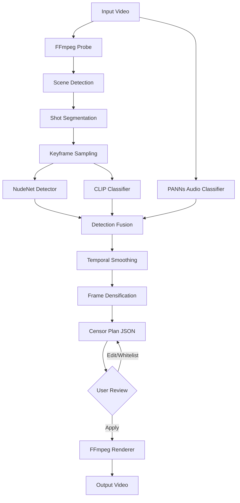

# Architecture

## Overview

PureFrame is a local video processing pipeline that detects explicit content and applies censoring overlays. The entire system runs offline after initial model download.

## Pipeline Diagram



## Component Details

### 1. Video Probe (`pipeline/probe.py`)

Extracts video metadata using FFmpeg: resolution, frame rate, duration, codec, audio streams.

### 2. Scene Detection (`pipeline/detect/scene.py`)

Uses PySceneDetect to segment the video into shots at scene boundaries (hard cuts, dissolves).

### 3. Shot Segmentation (`pipeline/shots.py`)

Organizes frames into shot objects with start/end frame indices and timestamps.

### 4. Keyframe Sampling (`pipeline/sample.py`)

Selects representative keyframes from each shot for efficient detection. The number of keyframes per shot is controlled by the hardware profile.

### 5. Detection Layer

Three independent classifiers run on sampled keyframes:

| Detector | Model | Input | Output |
|----------|-------|-------|--------|
| **NudeNet** (`detect/nudity.py`) | NudeNet ONNX | BGR frames | Bounding boxes + labels + scores |
| **CLIP** (`detect/scene_clip.py`) | CLIP ViT-B/32 | BGR frames | Scene category probabilities |
| **PANNs** (`detect/audio.py`) | CNN14 | Audio waveform | Audio event probabilities |

### 6. Detection Fusion (`pipeline/fuse.py`)

Combines signals from all three detectors into a single verdict per shot using weighted voting:

```
verdict = fuse(nudity_detections, clip_scores, audio_scores, thresholds)
```

### 7. Temporal Smoothing (`pipeline/smooth.py`)

Reduces detection jitter by smoothing verdicts across adjacent shots. Prevents single-frame flickers.

### 8. Frame Densification (`pipeline/densify.py`)

Expands keyframe-level detections to cover all frames within a shot. Controlled by `densify_every_n_frames` setting.

### 9. Censor Plan (`pipeline/render/plan.py`)

Serializes all detection results and configuration into a portable JSON file. This is the user-reviewable artifact.

### 10. Renderer (`pipeline/render/apply.py`)

Applies censoring overlays (black box or Gaussian blur) frame-by-frame using OpenCV, then encodes the output via FFmpeg subprocess.

### 11. Hardware Abstraction (`hardware.py`)

Detects available hardware (CUDA, MPS, CPU) and selects appropriate profiles:

| Profile | VRAM | Batch Size | Resolution | Encoder |
|---------|------|-----------|------------|---------|
| HIGH | 8+ GB | 32 | 1080p | h264_nvenc |
| MEDIUM | 4-8 GB | 16 | 720p | h264_nvenc |
| LOW | 2-4 GB | 4 | 540p | h264_nvenc |
| CPU | 0 | 1 | 480p | libx264 |

### 12. Checkpoint Store (`checkpoint.py`)

SQLite-based job tracking for crash recovery and batch processing. Stores job state (PENDING, DETECTING, RENDERING, DONE, FAILED) and serialized verdict data.

---

## Data Flow

```
User → CLI → Config → Pipeline → Censor Plan → [Review] → Renderer → Output
                 ↓
           Checkpoint Store
```

## File Layout

```
pureframe/
├── __init__.py
├── cli.py              # Typer CLI commands
├── config.py           # Pydantic configuration model
├── hardware.py         # Hardware detection and profiles
├── batch.py            # Folder batch processing
├── checkpoint.py       # SQLite job store
├── data/               # Default data files
├── tracking/           # Detection tracking utilities
├── pipeline/
│   ├── probe.py        # FFmpeg video metadata
│   ├── shots.py        # Shot segmentation types
│   ├── sample.py       # Keyframe sampling
│   ├── densify.py      # Frame densification
│   ├── smooth.py       # Temporal smoothing
│   ├── fuse.py         # Multi-detector fusion
│   ├── detect/
│   │   ├── nudity.py   # NudeNet detector
│   │   ├── scene_clip.py  # CLIP classifier
│   │   ├── audio.py    # PANNs audio classifier
│   │   ├── face.py     # Face detector
│   │   └── scene.py    # Scene boundary detection
│   └── render/
│       ├── plan.py     # Censor plan model
│       └── apply.py    # FFmpeg rendering
└── utils/
    ├── ffmpeg.py       # FFmpeg process management
    └── logging.py      # Logging configuration
```

## Technology Stack

| Component | Technology | Version |
|-----------|------------|---------|
| Language | Python | 3.11+ |
| CLI Framework | Typer + Rich | Latest |
| ML Inference | PyTorch + ONNX Runtime | 2.4+ / 1.15+ |
| Video Processing | FFmpeg + OpenCV | 4.4+ / 4.8+ |
| Configuration | Pydantic | 2.0+ |
| Scene Detection | PySceneDetect | 0.6+ |
| Desktop GUI | Tauri + React + TypeScript | 2.0 |
